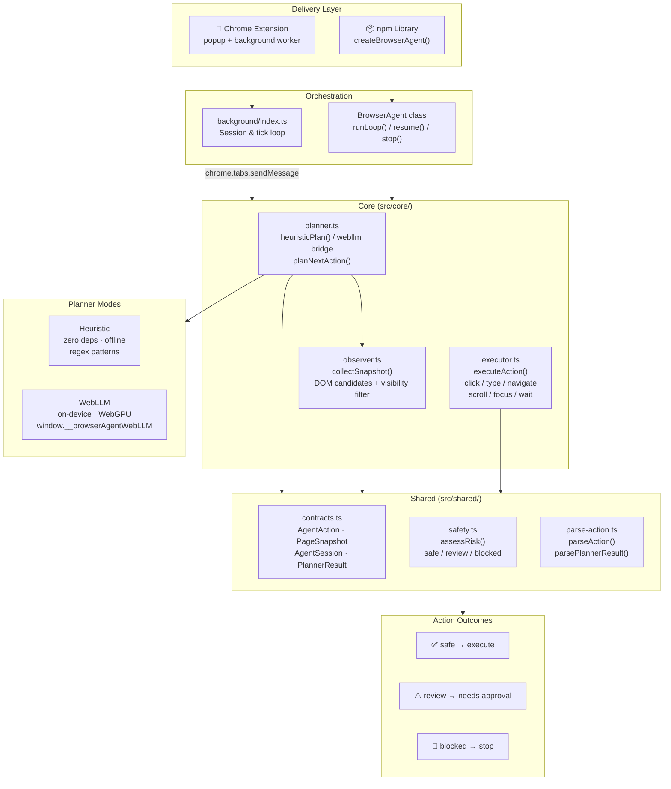

# omnibrowser-agent

[](https://www.npmjs.com/package/@akshayram1/omnibrowser-agent)
[](LICENSE)

Local-first browser AI operator. Plans and executes DOM actions entirely in the browser — no API keys, no cloud costs, no data leaving your machine.

[Live Demo](https://omnibrowser-agent.vercel.app/examples/chatbot/) · [Embedding Guide](docs/EMBEDDING.md) · [Architecture](docs/arch.md) · [Deployment](docs/DEPLOYMENT.md) · [Roadmap](docs/ROADMAP.md)

---

## Architecture



---

## How it works — one tick

```
goal + history + memory
        │
        ▼
observer.collectSnapshot()  ──→  PageSnapshot (url, title, candidates[])
        │
        ▼
planner.planNextAction()    ──→  PlannerResult { action, evaluation?, memory?, nextGoal? }
        │
        ▼
safety.assessRisk(action)   ──→  safe | review | blocked
        │
   ┌────┴─────────────────────┐
blocked             review (human-approved mode)
   │                          │
  stop              pause → user approves → resume
                              │
                         safe / approved
                              │
                              ▼
             executor.executeAction(action)  ──→  result string
                              │
                              ▼
                   session.history.push(result)
                   → next tick
```

The planner uses a **reflection loop** before each action: it evaluates what happened last step, maintains working memory across steps, and states its next goal — giving the agent much better multi-step reasoning.

---

## Install

```bash
npm install @akshayram1/omnibrowser-agent
```

---

## Quick start

```ts
import { createBrowserAgent } from "@akshayram1/omnibrowser-agent";

const agent = createBrowserAgent({
  goal: "Search for contact Jane Doe and open her profile",
  mode: "human-approved",        // or "autonomous"
  planner: { kind: "heuristic" } // or "webllm"
}, {
  onStep:             (result, session) => console.log(result.message),
  onApprovalRequired: (action, session) => console.log("Review:", action),
  onDone:             (result, session) => console.log("Done:", result.message),
  onError:            (err,    session) => console.error(err),
  onMaxStepsReached:  (session)         => console.log("Max steps hit"),
});

await agent.start();

// After onApprovalRequired fires:
await agent.resume();

// Cancel at any time:
agent.stop();
```

---

## Planner modes

| Mode | Description | When to use |
|---|---|---|
| `heuristic` | Zero-dependency regex planner. Works fully offline. | Simple, predictable goals — navigate, fill, click |
| `webllm` | On-device LLM via WebGPU. Fully private, no API calls. | Open-ended, multi-step, language-heavy goals |

### WebLLM with a custom system prompt

```ts
const agent = createBrowserAgent({
  goal: "Fill the checkout form",
  planner: {
    kind: "webllm",
    systemPrompt: "You are a careful checkout assistant. Never submit before all required fields are filled."
  }
});
```

See [docs/EMBEDDING.md](docs/EMBEDDING.md) for the full WebLLM bridge wiring guide.

---

## Agent modes

| Mode | Behaviour |
|---|---|
| `autonomous` | All `safe` and `review` actions execute without pause |
| `human-approved` | `review`-rated actions pause and emit `onApprovalRequired` — call `resume()` to continue |

---

## Supported actions

| Action | Description | Risk |
|---|---|---|
| `navigate` | Navigate to a URL (http/https only) | safe |
| `click` | Click an element by CSS selector | safe / review |
| `type` | Type text into an input or textarea | safe / review |
| `scroll` | Scroll a container or the page | safe |
| `focus` | Focus an element | safe |
| `wait` | Pause for N milliseconds | safe |
| `extract` | Extract text from an element | review |
| `done` | Signal task completion | safe |

---

## AbortSignal support

```ts
const controller = new AbortController();
const agent = createBrowserAgent({ goal: "...", signal: controller.signal });
agent.start();

controller.abort(); // cancel from outside
```

---

## Chrome Extension

1. Build:

```bash
npm run build
```

2. Open `chrome://extensions`, enable **Developer Mode**, click **Load unpacked**, select `dist/`.

3. Open any tab, enter a goal in the popup, pick a mode, and click **Start**.

See [docs/DEPLOYMENT.md](docs/DEPLOYMENT.md) for publishing and CI pipeline details.

---

## Project structure

```
src/
├── background/      Extension service worker — session management
├── content/         Extension content script — runs in page context
├── core/            Shared engine (planner, observer, executor)
│   ├── planner.ts
│   ├── observer.ts
│   └── executor.ts
├── lib/             npm library entry — BrowserAgent class
│   └── index.ts
├── popup/           Extension popup UI
└── shared/          Types, safety, and parse utilities
    ├── contracts.ts
    ├── safety.ts
    └── parse-action.ts
```

---

## Changelog

### v0.2.6

- Reflection-before-action pattern (`evaluation → memory → next_goal → action`) — agent reasons about each step before acting
- Working memory carried across ticks for better multi-step goals
- `parsePlannerResult()` exported from the library
- `systemPrompt` option in `PlannerConfig` — pass your own prompt without rewriting the bridge
- Thought bubble (💭) messages in the live demo chat showing the agent's next intent

### v0.2.4 — v0.2.5

- CI pipeline: auto version bump on push to main
- Removed page-agent dependency — reflection pattern implemented natively
- Chatbot demo redesign: right-aligned user messages, typing indicator, tab navigation (CRM + Task Manager)
- `parsePlannerResult()` and `PlannerResult` type exported from library

### v0.2.2

- SDK/extension separation: core logic in `src/core/` shared between extension and npm library
- 22 unit tests across planner and safety modules
- Action verification in executor (disabled-check, value-verify, empty-check)
- `CandidateElement.label` from associated `<label>` elements
- Retry loop with `lastError` fed back to planner on failure

### v0.2.0

- New actions: `scroll` and `focus`
- Smarter safety: risk assessment checks element label/text
- Improved heuristic planner with regex pattern matching
- Better page observation: filters invisible elements, up to 60 candidates
- Library API: `resume()`, `isRunning`, `hasPendingAction`, `onMaxStepsReached`, `AbortSignal`

### v0.1.0

- Extension runtime loop, shared action contracts, heuristic + WebLLM planner, human-approved mode

---

## Docs

- [Embedding Guide](docs/EMBEDDING.md) — integrate into any web app
- [Architecture](docs/arch.md) — layer-by-layer breakdown
- [Deployment](docs/DEPLOYMENT.md) — npm publish, Vercel, Chrome extension, CI
- [Roadmap](docs/ROADMAP.md) — planned features

---

## License

MIT © Akshay Chame
