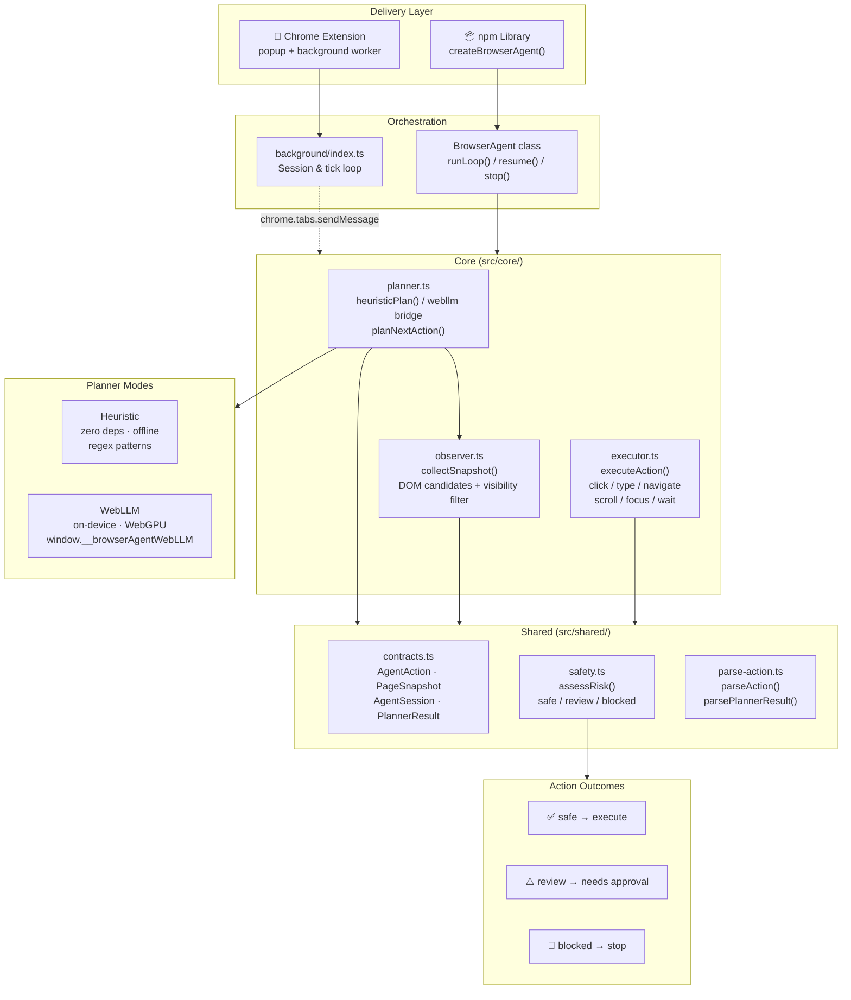

# omnibrowser-agent — Architecture

> Local-first browser AI operator. Runs entirely in the browser — no API keys, no cloud costs, no data leaving your machine.

---

## Architecture Diagram



---

## Layer-by-layer explanation

### Delivery layer

There are two ways to use omnibrowser-agent, and they share the same underlying engine.

**Chrome extension** — Install by loading the `dist/` folder as an unpacked extension in Chrome. A popup UI lets you enter a goal, pick a mode, and click Start. The background service worker manages session state and orchestrates the tick loop across tabs.

**npm library** — Embed agent logic directly into any web app. Import `createBrowserAgent()` from `@akshayram1/omnibrowser-agent`, pass a goal and config, and wire up event callbacks. No extension required.

---

### Orchestration

**`background/index.ts`** (extension path) maintains a `Map<tabId, AgentSession>` and drives each session forward by sending `AGENT_TICK` messages to the active tab's content script. It handles `START_AGENT`, `APPROVE_ACTION`, `STOP_AGENT`, and `GET_STATUS` messages from the popup.

**`BrowserAgent` class** (library path) runs the same tick loop in-process. It exposes `start()`, `resume()`, `stop()`, `isRunning`, and `hasPendingAction`, along with a full event callback API (`onStep`, `onApprovalRequired`, `onDone`, `onError`, `onMaxStepsReached`). Supports `AbortSignal` for external cancellation.

---

### Core  (`src/core/`)

These three modules are **shared** between the extension content script and the library. Neither delivery path duplicates them.

| Module | Responsibility |
|---|---|
| `planner.ts` | Decides the next action given a goal, page snapshot, and history |
| `observer.ts` | Reads the live DOM and returns a structured `PageSnapshot` |
| `executor.ts` | Performs DOM actions and returns a result string |

**`observer.ts` — `collectSnapshot()`**
Queries all interactive elements (`a`, `button`, `input`, `textarea`, `select`, `[role=button]`, `[contenteditable]`), filters out invisible ones (hidden, `display:none`, zero dimensions), and prioritises in-viewport elements. Resolves accessible labels via `aria-labelledby`, `aria-label`, `for/id`, and wrapping `<label>`. Caps at 60 candidates. Returns `url`, `title`, `textPreview`, and `candidates[]`.

**`planner.ts` — `planNextAction()`**
Two modes:
- *Heuristic* — pure regex. Matches `go to <url>`, `search for <x>`, `fill "<text>" in <field>`, `click <target>` patterns against the goal string, then falls back to filling the first visible input or clicking the first visible button.
- *WebLLM* — delegates to `window.__browserAgentWebLLM.plan()`. The bridge is external — you wire it in. Accepts both legacy `AgentAction` returns and the new `PlannerResult` (with `evaluation`, `memory`, `nextGoal` reflection fields).

**`executor.ts` — `executeAction()`**
Performs the action. Uses `InputEvent` with `bubbles: true` so React/Vue controlled inputs receive proper framework events. Verifies: element exists, is not disabled (for clicks), value updated (for type), extracted text is non-empty. Throws on failure so the retry loop can feed `lastError` back to the planner.

---

### Shared  (`src/shared/`)

**`contracts.ts`** — All TypeScript interfaces and union types. The single source of truth for `AgentAction`, `PageSnapshot`, `AgentSession`, `PlannerResult`, `ContentResult`, and the library config/event types.

**`safety.ts` — `assessRisk()`**
Returns one of three risk levels for any action:

| Level | Meaning | Examples |
|---|---|---|
| `safe` | Execute immediately | `navigate` to http/https, `click` neutral label, `scroll`, `wait`, `focus` |
| `review` | Pause for human approval in `human-approved` mode | `extract`, `click`/`type` on labels matching delete/pay/submit/confirm/transfer |
| `blocked` | Never execute | `navigate` to `javascript:`, `file:`, or malformed URLs |

**`parse-action.ts`** — Handles LLM output that may be wrapped in markdown fences, embedded in prose, or using the full reflection format `{ evaluation, memory, next_goal, action }`. Gracefully returns a `done` action on any parse failure so the loop never crashes.

---

### Planner modes

| Mode | Description | When to use |
|---|---|---|
| `heuristic` | Zero-dependency regex-based planner. Works fully offline. | Simple, predictable goals — navigate, search, fill a field, click a button |
| `webllm` | Delegates to a `window.__browserAgentWebLLM` bridge. Fully private, runs on-device via WebGPU. | Open-ended, multi-step, or language-heavy goals |

---

### Agent modes

| Mode | Behaviour |
|---|---|
| `autonomous` | All `safe` and `review` actions execute without pause |
| `human-approved` | `review`-rated actions pause and emit `onApprovalRequired` — user must call `resume()` or click **Approve** in the popup |

---

### Data flow (one tick)

```
goal + history
      │
      ▼
observer.collectSnapshot()  ──→  PageSnapshot (url, title, candidates[])
      │
      ▼
planner.planNextAction()    ──→  PlannerResult { action, evaluation?, memory?, nextGoal? }
      │
      ▼
safety.assessRisk(action)   ──→  safe | review | blocked
      │
   ┌──┴──────────────────────┐
blocked               review (human-approved mode)
   │                         │
stop                  pause → user approves → resume
                             │
                        safe / approved
                             │
                             ▼
              executor.executeAction(action)  ──→  result string
                             │
                             ▼
                    session.history.push(result)
                    → next tick
```

---

## Project structure

```
src/
├── background/      Extension service worker — session management
├── content/         Extension content script — runs in page context
├── core/            Shared engine (planner, observer, executor)
│   ├── planner.ts
│   ├── observer.ts
│   └── executor.ts
├── lib/             npm library entry — BrowserAgent class
│   └── index.ts
├── popup/           Extension popup UI
│   ├── index.html
│   └── index.ts
└── shared/          Types, safety, and parse utilities
    ├── contracts.ts
    ├── safety.ts
    └── parse-action.ts
```

---

## Quick reference

```ts
import { createBrowserAgent } from "@akshayram1/omnibrowser-agent";

const agent = createBrowserAgent({
  goal: "Search for contact John Smith in CRM",
  mode: "human-approved",        // or "autonomous"
  planner: { kind: "heuristic" } // or "webllm"
}, {
  onStep:            (result, session) => console.log(result.message),
  onApprovalRequired:(action, session) => console.log("Review:", action),
  onDone:            (result, session) => console.log("Done:", result.message),
});

await agent.start();

// After onApprovalRequired fires:
await agent.resume();

// Cancel at any time:
agent.stop();
```

---

*MIT © Akshay Chame — [github.com/akshayram1/omnibrowser-agent](https://github.com/akshayram1/omnibrowser-agent)*